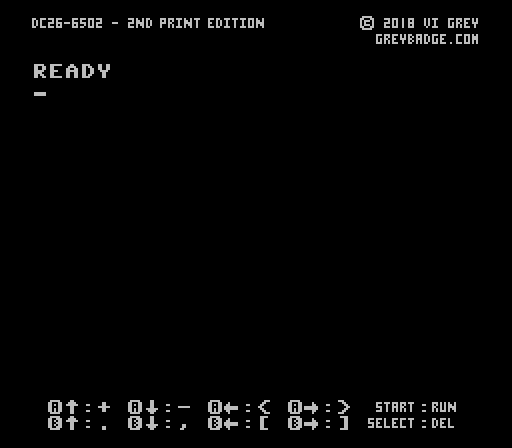
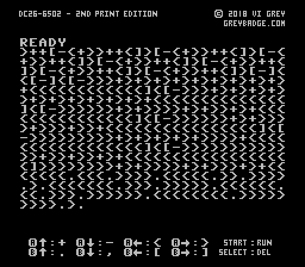
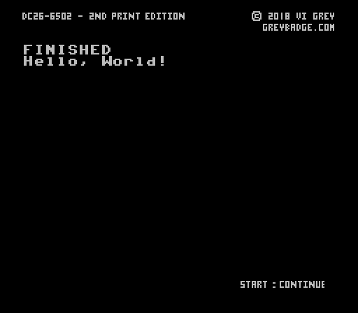

# DC26-6502 (Brainf--k Interpreter NES Cartridge)

A brainf--k interpreter written for NES cartridge to be played on real NES hardware.

**_DC26-6502 was created by Vi Grey and is licensed under the BSD 2-Clause License._**

### Description:
This NES game is an interpreter for the brainf--k programming language, a programming language that uses only 8 symbols.  The standard NES controller is used to create and run programs using only the power of the NES hardware CPU.

### Platforms:
- GNU/Linux

### Build Dependencies:
- asm6 _(You'll probably have to build asm6 from source.  Make sure the asm6 binary is named **asm** and that the binary is executable and accessible in your PATH. The source code can be found at **http://3dscapture.com/NES/asm6.zip** or in the included directory **resources/asm6.zip**)_
- zip

### Build NES ROM:
From a terminal, go to the the main directory of this project (the directory this README.md file exists in), you can then build the NES ROM with the following command.

    $ make

The resulting NES ROM will be located at **bin/dc26-6502.nes** and should have the SHA-256 hash of `85816790f8f77f071890498db6b8e68f0b7c1f564f039cea05b30eef8d0bcc42`

### Cleaning Build Environment:
If you used `make` to build the NES ROM, you can run the following command to clean up the build environment.

    $ make clean

### Controls:
- A + Up: `+`
- A + Down: `-`
- A + Left: `<`
- A + Right: `>`
- B + Up: `.`
- B + Down: `,`
- B + Left: `[`
- B + Right: `]`
- Start: `Run`
- Select: `Backspace`

### Specifications:
- 1024 Byte Instruction Buffer _($0200-$05FF)_
- 512 Byte Memory Tape _($0600-$0FFF)_
- 28 x 19 Print Screen Size _(7 bit ASCII Characters)_

### Screenshots:

(_READY Screen_)

(_Brainf--k Code Written Out_)

(_FINISHED Interpreting Screen_)

### Extras:
- #### Unzipping the ROM:

  The compiled NES ROM file at **bin/dc26-6502.nes** will also be a functioning ZIP file that contains 2 files, **bfinterpreter.py** and **ascii2bf.py**.

- #### Interpreting the ROM:

  This NES ROM is also a functional brainf--k file.  Using `python3 bfinterpreter.py dc26-6502.nes` will allow you to interpret the brainf--k file content of the NES ROM.

- #### Creating Brainf--k Programs:  

  An included tool, **ascii2bf.py** allows you to create a brainf--k program for any file that is a multiple of 8 bits long.  To create a brainf--k program, use `python3 ascii2bf.py filename` where _filename_ is the path to the file you want to create a brainf--k program for.

- #### NES Mapper:

  This NES ROM runs as an NROM-256 ROM, but can also work as an NROM-128 ROM.

- #### **^ ^ v v < > < > B A**

### License:
    Copyright (C) 2018, Vi Grey
    All rights reserved.

    Redistribution and use in source and binary forms, with or without
    modification, are permitted provided that the following conditions
    are met:

        1. Redistributions of source code must retain the above copyright
           notice, this list of conditions and the following disclaimer.
        2. Redistributions in binary form must reproduce the above copyright
           notice, this list of conditions and the following disclaimer in the
           documentation and/or other materials provided with the distribution.

    THIS SOFTWARE IS PROVIDED BY AUTHOR AND CONTRIBUTORS \`\`AS IS'' AND
    ANY EXPRESS OR IMPLIED WARRANTIES, INCLUDING, BUT NOT LIMITED TO, THE
    IMPLIED WARRANTIES OF MERCHANTABILITY AND FITNESS FOR A PARTICULAR PURPOSE
    ARE DISCLAIMED. IN NO EVENT SHALL AUTHOR OR CONTRIBUTORS BE LIABLE
    FOR ANY DIRECT, INDIRECT, INCIDENTAL, SPECIAL, EXEMPLARY, OR CONSEQUENTIAL
    DAMAGES (INCLUDING, BUT NOT LIMITED TO, PROCUREMENT OF SUBSTITUTE GOODS
    OR SERVICES; LOSS OF USE, DATA, OR PROFITS; OR BUSINESS INTERRUPTION)
    HOWEVER CAUSED AND ON ANY THEORY OF LIABILITY, WHETHER IN CONTRACT, STRICT
    LIABILITY, OR TORT (INCLUDING NEGLIGENCE OR OTHERWISE) ARISING IN ANY WAY
    OUT OF THE USE OF THIS SOFTWARE, EVEN IF ADVISED OF THE POSSIBILITY OF
    SUCH DAMAGE.
